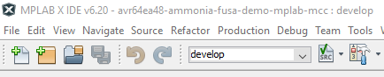
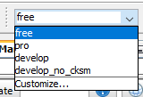
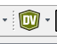
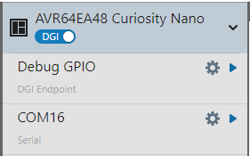

<!-- Please do not change this logo with link -->

# Functional Safety Class B - Ammonia Gas Sensor with AVR64EA48

Gas leak detection systems are prevalent in many industries and residences today. To develop a safe and reliable device, functional safety must be implemented into its' design. Gas leak detection systems can fall under various functional safety standards depending on where the system's intended use is. For this example, the Microchip PIC&reg; and AVR&reg; UL-certified IEC 60730 Class B software diagnostic library implements functional safety tests. These tests help ensure hardware faults are identified and dealt with if they occur. If a fault occurs and it is not identified, the application could act differently than expected, which poses potential harm to users or the environment. This example uses the AVR64EA32 family of microcontrollers (MCUs) to implement a simple ammonia gas detector which uses the Class B Functional Safety (FuSa) libraries. 

## Warnings

**This example is for demonstration purposes only, and is not qualified, tested or verified to meet Class B safety standards.**

When handling the ammonia containing solution, excerise caution and follow manufacturer's recommendations for ventilation and safety. 

## Changes to Class B Libraries

A minor change was made to the Class B library to convert the Cyclic Redundancy Check (CRC) from big-endian to little-endian when stored in flash. This enables the SW checksum to be compatiable with the HW checksum.  

## Related Documentation

- [Introduction to Functional Safety](https://mu.microchip.com/introduction-to-functional-safety)
- [Class B Diagnostic Libraries for Functional Safety](https://mu.microchip.com/class-b-diagnostic-libraries-for-functional-safety)
- [MQ137 Ammonia Sensor Product Page](https://www.winsen-sensor.com/product/mq137.html)
- [AVR64EA48 Product Page](https://www.microchip.com/en-us/product/avr64ea32?utm_source=GitHub&utm_medium=TextLink&utm_campaign=MCU8_AVR-EA&utm_content=avr64ea48-ammonia-fusa-demo-mplab-mcc-github&utm_bu=MCU08)

## Software Used

- [MPLAB&reg; X IDE v6.20 or newer](https://www.microchip.com/en-us/tools-resources/develop/mplab-x-ide?utm_source=GitHub&utm_medium=TextLink&utm_campaign=MCU8_AVR-EA&utm_content=avr64ea48-ammonia-fusa-demo-mplab-mcc-github&utm_bu=MCU08)
- [MPLAB XC8 v2.46 or newer](https://www.microchip.com/en-us/tools-resources/develop/mplab-xc-compilers?utm_source=GitHub&utm_medium=TextLink&utm_campaign=MCU8_AVR-EA&utm_content=avr64ea48-ammonia-fusa-demo-mplab-mcc-github&utm_bu=MCU08)
- [MPLAB Code Configurator (MCC)](https://www.microchip.com/en-us/tools-resources/configure/mplab-code-configurator?utm_source=GitHub&utm_medium=TextLink&utm_campaign=MCU8_AVR-EA&utm_content=avr64ea48-ammonia-fusa-demo-mplab-mcc-github&utm_bu=MCU08)
- AVR-Ex_DFP v2.8.189 or newer

## Hardware Used

- [AVR64EA48 Curiosity Nano Evaluation Kit (EV66E56A)](https://www.microchip.com/en-us/development-tool/EV66E56A?utm_source=GitHub&utm_medium=TextLink&utm_campaign=MCU8_AVR-EA&utm_content=avr64ea48-ammonia-fusa-demo-mplab-mcc-github&utm_bu=MCU08)
- [Curiosity Nano Base for Click Boards&trade; (AC164162)](https://www.microchip.com/en-us/development-tool/AC164162?utm_source=GitHub&utm_medium=TextLink&utm_campaign=MCU8_AVR-EA&utm_content=avr64ea48-ammonia-fusa-demo-mplab-mcc-github&utm_bu=MCU08)
- [Ammonia Click (MIKROE-4151)](https://www.mikroe.com/ammonia-click)
- [(Optional) BUZZ 2 Click (MIKROE-2720)](https://www.mikroe.com/buzz-2-click)
- [2x2 Key Click (MIKROE-2152)](https://www.mikroe.com/2x2-key-click)
- Ammonia Solution, such as household glass cleaner

## Setup

### Hardware Setup
1. With the power off, insert the AVR64EA48 Curiosity Nano into the Curiosity Nano Base.
2. Insert the Ammonia Click into Slot 1.
3. On the Ammonia Click, turn the gain potentiometer to the minimum position. 
4. Insert the Buzz 2 Click in Slot 2, if using one.
5. Insert the 2x2 Key Click into Slot 3.
6. Connect the Curiosity Nano to the Computer with a USB cable.
7. Program the Curiosity Nano with the `Free` or `Pro` configuration. (For more information, please see Program Setup).
8. Wait for the sensor to warm-up.
9. Once warmed up, press and hold SW0 until the calibration completes.
10. Spray a solution containing ammonia near the sensor or apply the liquid to a towel or cloth and waft it over the element. The sensor will react to the change in environmental conditions within a few seconds.

### Program Configuration Setup

There are four program configurations inside the project. **Note** The sensor requires a 24 hour warm-up time before becoming stable. If the microcontroller is power cycled during programming, the timer will restart. For evaluation purposes, only `free` and `pro` configurations should be used as these are the "production" versions. 

For development, only `develop` and `develop_no_cksm` should be used. These development versions do not enforce the 24 hour warm-up time, they will power-up even if the system fails self-check, and retain EEPROM values across programming cycles. Note, only the `develop_no_cksm` version is capable of entering debug mode, but will fail the flash checksum on startup. **Note:** The user is responsible for ensuring the sensor has warmed up in these modes.

Please consult the table below to determine which configuration to use. **For initial evaluation purposes, `free` or `pro` is recommended.**

| Configuration | Optimization Level | Debug Mode Capable | 24 Hour Warm-Up Time | EEPROM Retained | Checksum Valid
| --- | ---- | ---- | ---- | ---- | ----- 
| free | 1 | No | Yes | No | Yes
| pro | S | No | Yes | No | Yes
| develop | 1 | No | No | Yes | Yes
| develop_no_cksm | 1 | Yes | No | Yes | No

#### Setting Program Configuration

1. Open the project inside of MPLAB X IDE.
2. At the top left side of the screen, press the white drop-down box (develop in the image).  
  
3. Select the desired configuration from the list.  

4. Recommended configuration for initial testing is `free` or `pro`.

### Data Visualizer Setup

1. In MPLAB X IDE, press the Data Visualizer Icon (shown below) in the top toolbar.  
  
2. On the left side of the screen, click the gear icon next to the COM port. The port number may vary.  
  
3. Set the baud rate to 115200. No other changes are needed.
4. Press the play button next to the gear.
5. When prompted, press Send to Terminal, then close.  

### I/O Usage

| Pin | Function
| --- | --------
| PA5 | SDO, Reserved (Ammonia Click)
| PA6 | SCLK, Reserved (Ammonia Click)
| PA7 | CS1, Reserved (Ammonia Click)
| PB2 | SW0
| PB3 | LED0
| PC0 | UART TX 
| PC1 | UART RX, Reserved
| PD0 | Sensor Heater (Ammonia Click)
| PD1 | Buzzer (Buzz 2 Click)
| PD2 | Button 4, Reserved (2x2 Click)
| PD4 | Sensor Output (Ammonia Click)
| PD6 | DAC0 Output
| PD7 | Button 1 (2x2 Click)
| PE0 | Button Interrupt, Reserved (2x2 Click)
| PE1 | Button 3, Reserved (2x2 Click)
| PE3 | Button 2 (2x2 Click)
| PF6 | nRESET
| PF7 | UPDI

**Note**: Reserved pins are not used in the example, but are allocated by hardware. 

## Class B Tests Enabled

* CPU
    - Verifies the CPU registers are functioning correctly
* Flash*
    - Verifies the program flash memory 
* EEPROM*
    - Verifies the EEPROM data has not been corrupted
* SRAM 
    - Verifies the SRAM operation on Power-on-Reset (POR)
    - Periodically scan the memory for errors
* Watchdog Timer (WDT)
    - Verifies the WDT hardware is functioning

**Note**: The Flash and EEPROM have alternative verification modes that do not use the Class B libraries. For the Flash, set the macro `FUSA_ENABLE_FLASH_HW_SCAN` to use the CRC hardware to perform the scan, rather than the Class B library. For the EEPROM, set `FUSA_ENABLE_EEPROM_SIMPLE_CHECKSUM` to use a simpler checksum for calculations, rather than the Class B library. Both of these macros are defined in `application.h`.

## Operation

### Basic Operation

**Important: Set the ammonia click to minimum gain before power on!**

On Power-on-Reset (POR), the system boots up and performs a self-check of the hardware. If no issues are encountered, the system will enter a 24 hour warm-up phase for the sensor. During this period, the sensor will get warm to the touch. Once per hour, the microcontroller will print a message to the UART to indicate the current time remaining.

After warm-up, the system will check to see if a calibration is stored in internal EEPROM. If the calibration data is not present, it will print a message to the UART. The user must press and hold SW0 to begin the zero-point sensor calibration. 

Once complete, the system will switch to the Monitor state. Once per minute, the system flashes the LED, measures the output of the ammonia sensor, performs a self-test of the analog comparator, and then checks for any user inputs. If the ammonia level rises above 50 ppm, the system will enter the Alarm state, sounding the buzzer and blinking the LED. The system will remain in the Alarm state until the concentration drops below 30 ppm. 

The Calibration state can be re-entered by pressing SW0 in the Monitor state.

### Pushbutton Functionality

Button 1 on the 2x2 Click will force the system from monitor to alarm to test the buzzer.

Button 2 will reset the microcontroller.

### Errors

If at any point during the above an error occurs, the system will enter a Fault state, where it will blink the LED and sound the buzzer in a pattern. The message `SYSTEM FAULT` is printed to the UART every 10 seconds. This is an infinite loop, and can only be exited by power-cycling the microcontroller or by pulling the hardware reset on PF6 to ground.

**Note:** Button 2 will not reset the microcontroller when in this state.

## System States

This application is controlled by a state machine, as shown below. The state machine is called once per second to run the Watchdog Timer (WDT), get a sample from the sensor, move states, and perform self-checks.

TODO: State Machine Image

### SYS_INIT

This state is used for initializing the system on POR. The `SYS_INIT` state only is active during the function `Fusa_runStartupSelfTest` and POR. If a startup error occurs, the program switches to `SYS_ERROR`.  

### SYS_WARMUP

This state is active during the sensor warmup. Once an hour, a tick from the Real Timer Clock  (RTC) sets a flag and updates the remaining time. The polled function checks the flag status, clears it, and prints a message for the remaining time.

After 24 hours, the function `Application_isSensorReady` returns `true`, indicating the sensor is ready for use. If the internal EEPROM is valid, then the system switches to the `SYS_MONITOR` state or the `SYS_ALARM` state, depending on the status of the alarm. Otherwise, the system switches to the `SYS_CALIBRATE` state. 

### SYS_CALIBRATE

This state is used to handle the sensor calibration. To properly use the sensor, it is necessary to calibrate the sensor against a known zero point at specified environmental conditions. The user must press and hold SW0 until the calibration completes. If no errors occurred during calibration, the system switches to the `SYS_MONITOR` state.

### SYS_MONITOR

This state is used to monitor the sensor. The analog comparator is polled to see if the ammonia value is above the `ALARM_THRESHOLD_HIGH` point. If it is, the system transitions to `SYS_ALARM`. Otherwise, the analog comparator is checked by the function `Fusa_testAC`. During this function, the system temporarily enters the `SYS_SELF_TEST` state, but returns to `SYS_MONITOR` after executing. An error during self-test function will cause the system to enter the `SYS_ERROR` state. Finally, if no other issues have occurred and the Alarm Test button is pressed, then the system switches to `SYS_ALARM`.

### SYS_SELF_TEST

This state is only active during the self-test of the Analog Comparator. During this operation, the AC is disconnected from the sensor, and connected to the output of DAC0. At the end of this self-test, the sensor is reconnected to the AC and returned to the previous state. If this state is ever encountered outside of the self-test function, the system goes to the `SYS_ERROR` state.

### SYS_ALARM

This state is active when the alarm is triggered. In this state, the buzzer sounds and the LED blinks. When the threshold falls below the `ALARM_THRESHOLD_LOW` threshold, the system transitions to `SYS_MONITOR`. AC self-tests, alarm test, and other functions are not available in this mode.

### SYS_ERROR

This state is active if a self-test fails or the state machine enters an unexpected state. The LED blinks and the buzzer sounds in a pattern while printing `SYSTEM FAULT` to the UART. This state disables interrupts and acts as an infinite loop which cannot be escaped. 

## Summary

This example has shown how to implement an ammonia monitor using the Class B libraries on the AVR&reg; EA family of MCUs.